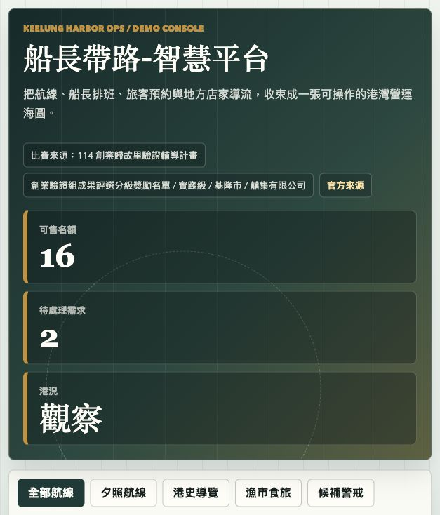
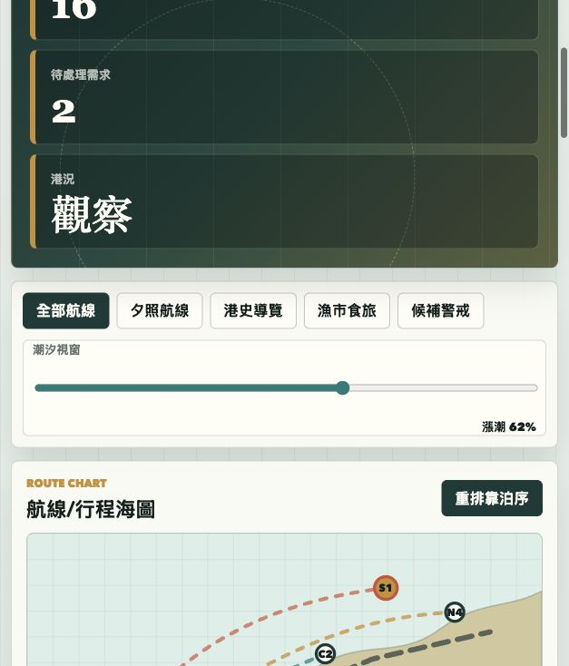

# 船長帶路-智慧平台 demo

## 快速看懂

- 線上 Demo：https://atlasforcn.github.io/startup-captain-guide-platform/
- 這個原型在做什麼：把船長帶路做成港灣體驗預約與營運中控台，串接行程、船長、旅客與安全檢核。
- 特色定位：特色是把地方體驗服務做成可派班、可預約、可追蹤的營運系統。
- 操作流程：選擇港灣體驗與船長時段 → 查看預約、天候與安全檢查 → 用中控台追蹤出航進度與旅客回饋

展開完整功能流程截圖

這個 repo 是依據官方公開得獎資訊，為 `船長帶路-智慧平台` 製作的原生 HTML/CSS/JS 互動 demo。原型把作品概念延伸為「基隆港灣營運中控台」：把船長、航線、天候、預約需求與地方合作店家串成同一個營運畫面。

## 比賽來源

- 比賽/計畫：114 創業歸故里驗證輔導計畫
- 屆次/階段：114 年名單，創業驗證組成果評選分級獎勵名單
- 獎項/級別：實踐級
- 縣市場域：基隆市
- 公司/團隊：囍集有限公司
- 得獎作品：船長帶路-智慧平台
- 官方來源：https://sccontest.tca.org.tw/content/display#sectionA

## 核心概念

「船長帶路」不是單一旅遊商品頁，而是一個能協調港灣體驗供給與需求的智慧平台。demo 以基隆在地海港體驗為情境，讓營運者可以看見每條航線的剩餘名額、風險提示、船長負載、預約狀態與合作店家導流。

設計方向刻意做成港灣營運中控台：海圖、潮汐、靠泊時間、浮標色、銅牌標籤與碼頭儀表，避免通用 SaaS、醫療、社交或 AI dashboard 的視覺語彙。

## Demo 範圍

- 航線/行程：依主題篩選航線，點選海圖或卡片可查看名額、風險、集合點與地方串聯。
- 船長排班：顯示船長證照、安全檢核、今日工時與負載，可把船長指派到目前選取航線。
- 預約需求：可新增旅客需求、快速預約、候補排隊，並切換待付款、已確認、候補等狀態。
- 地方成效：以模擬資料估算合作店家導流、體驗人次、地方營收與回訪意願。

這是靜態前端 demo，所有資料皆為模擬；未串接金流、保險、天氣 API、船舶定位或正式預約系統。本 repo 不代表原團隊正式產品，也未使用原團隊未公開資料或素材。
